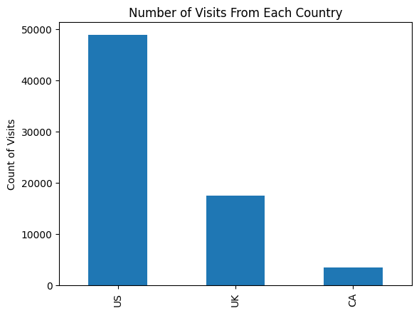
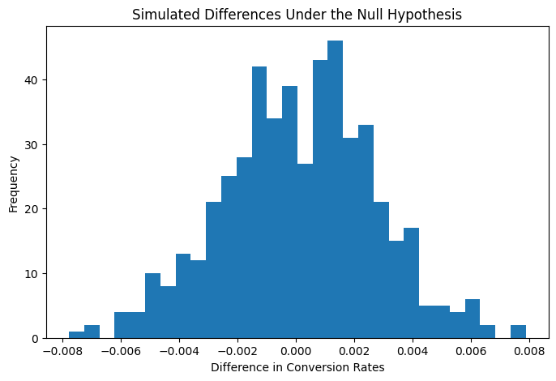

# A/B Testing Analysis

## Project Overview

This project analyzes an A/B test for an e-commerce website to determine whether a treatment page produced a higher conversion rate than the control page.

The analysis includes descriptive statistics, probability, simulation-based hypothesis testing, and logistic regression. Country is also tested as a possible predictor of conversion.

## Research Question

**Does the treatment page produce a higher conversion rate than the control page?**

## Technologies Used

- Python
- Jupyter Notebook
- pandas
- NumPy
- Matplotlib
- statsmodels
- Logistic Regression
- A/B Testing
- Hypothesis Testing

## Dataset

The analysis contains **69,889 observations** across three countries:

| Country | Observations |
|---|---:|
| US | 48,850 |
| UK | 17,551 |
| CA | 3,488 |

The experiment contains:

- **35,211 treatment observations**
- **34,678 control observations**
- An overall conversion rate of **13.05%**



## Conversion Results

The control group converted at approximately **10.53%**.

The treatment group converted at approximately **15.53%**.

That represents an observed increase of roughly **5 percentage points** for the treatment group.

## Hypothesis Test

The experiment tests:

- **Null hypothesis:** the treatment conversion rate is less than or equal to the control conversion rate.
- **Alternative hypothesis:** the treatment conversion rate is greater than the control conversion rate.

A sampling distribution was generated under the null hypothesis using **500 simulations**.



The notebook produced a simulation p-value of **0.0** across those 500 iterations. Under the simulation performed in the notebook, none of the simulated differences were at least as large as the observed treatment-control difference.

At a 0.05 significance level, the analysis rejects the null hypothesis and finds statistical evidence that the treatment page has a higher conversion rate.

## Logistic Regression

A logistic regression model was also fitted using page assignment as a predictor of conversion.

| Predictor | Coefficient | p-value |
|---|---:|---:|
| Treatment page | 0.4467 | < 0.001 |

The treatment-page coefficient is positive and statistically significant, supporting the result from the simulation-based test.

## Country Analysis

A second logistic regression model included treatment assignment and country.

| Predictor | Coefficient | p-value |
|---|---:|---:|
| Treatment page | 0.4466 | < 0.001 |
| US | 0.0727 | 0.170 |
| UK | 0.0067 | 0.905 |

Canada serves as the reference country.

The US and UK p-values are above 0.05, so this analysis did not find sufficient evidence that either country had a statistically significant effect on conversion relative to Canada after page assignment was included.

## Project Structure

```text
ab-testing-analysis/
│
├── README.md
├── notebooks/
│   └── ab_test_analysis.ipynb
│
├── src/
│   ├── __init__.py
│   ├── descriptive_analysis.py
│   ├── hypothesis_testing.py
│   ├── regression.py
│   └── visualization.py
│
├── images/
│   ├── country_visits.png
│   └── null_distribution.png
│
├── data/
│   └── README.md
│
├── requirements.txt
└── .gitignore
```

## Main Skills Demonstrated

- A/B test analysis
- Descriptive statistics
- Conditional probability
- Conversion-rate analysis
- Hypothesis testing
- Null-distribution simulation
- p-value interpretation
- Logistic regression
- Dummy-variable encoding
- Statistical significance testing
- Data visualization

## Running the Project

Install the required packages:

```bash
pip install -r requirements.txt
```

The notebook expects the original `ab_data.csv` dataset. Add the dataset to your local working directory or update the CSV path in the notebook before running all cells.
