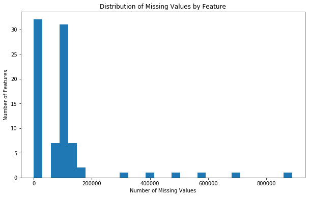
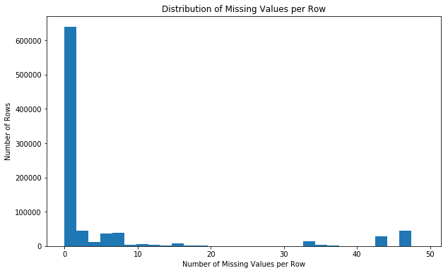
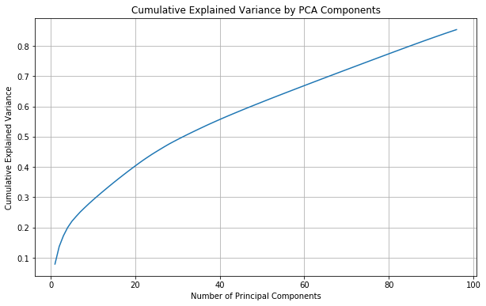
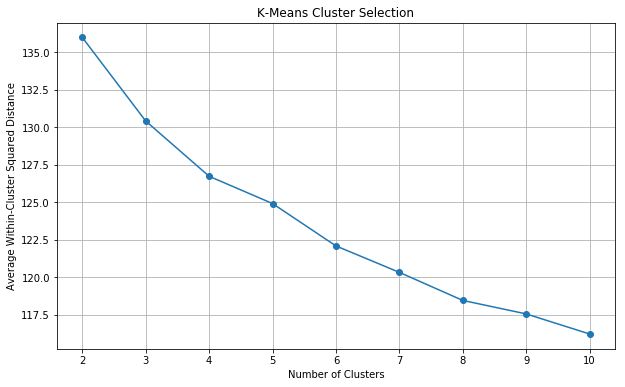
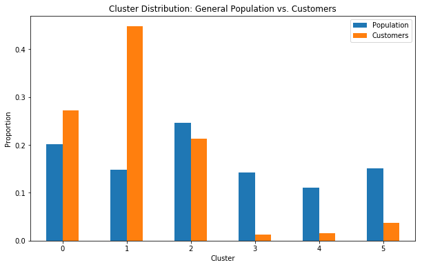

# Customer Segmentation with Unsupervised Learning

## Project Overview

This project uses unsupervised machine learning to identify customer segments for a mail-order sales company in Germany.

Demographic data from the German general population are cleaned and transformed, reduced with **Principal Component Analysis (PCA)**, and grouped using **K-Means clustering**. Customer records are then mapped into the same clusters so their representation can be compared with the general population.

The analysis is designed to identify demographic groups that appear more or less frequently among existing customers.

## Technologies Used

- Python
- Jupyter Notebook
- pandas
- NumPy
- scikit-learn
- Matplotlib
- Seaborn
- Principal Component Analysis
- K-Means Clustering
- Feature Scaling
- One-Hot Encoding
- Missing-Value Imputation

## Data

The original project uses demographic data supplied by Bertelsmann Arvato Analytics.

The source materials describe:

- **891,211** general-population records with 85 original features
- **191,652** customer records with 85 original features
- A feature summary describing the demographic variables

The original datasets are not redistributed in this portfolio repository.

## Data Preparation

The notebook performs several preprocessing steps before clustering.

### Missing Data

Missing values are assessed by feature and by row.





Features with substantial missingness are examined before the cleaned dataset is prepared.

### Feature Engineering

The preprocessing work includes:

- Converting missing-value codes to null values
- Removing selected high-missingness fields
- Separating rows by missing-data level for comparison
- Re-encoding categorical variables
- One-hot encoding
- Engineering mixed-type variables
- Imputing remaining missing values
- Standardizing numeric features

After preprocessing and encoding, the notebook reports **192 features** entering the scaling and PCA stage.

## Principal Component Analysis

PCA is used to reduce the dimensionality of the standardized demographic dataset.



The cumulative explained-variance curve is used to select the number of components retained for clustering. Component weights are also examined to interpret which demographic features contribute most strongly to selected principal components.

## K-Means Clustering

K-Means models are fitted across several cluster counts and compared using average within-cluster squared distance.



The completed analysis selects **six clusters** for the final segmentation model.

## Customer Segmentation

The preprocessing, scaling, PCA transformation, and fitted K-Means model are then applied to the customer dataset.

Customer cluster proportions are compared against cluster proportions from the German general population.



This comparison identifies customer segments that are overrepresented or underrepresented relative to the population, which can support audience selection for future marketing analysis.

## Project Structure

```text
customer-segmentation-unsupervised-learning/
│
├── README.md
│
├── notebooks/
│   └── customer_segmentation.ipynb
│
├── src/
│   ├── __init__.py
│   ├── modeling.py
│   └── evaluation.py
│
├── images/
│   ├── missing_values_by_feature.png
│   ├── missing_values_by_row.png
│   ├── missing_subset_finanz_minimalist.png
│   ├── missing_subset_finanz_sparer.png
│   ├── missing_subset_finanz_vorsorger.png
│   ├── missing_subset_semio_soz.png
│   ├── missing_subset_semio_kult.png
│   ├── pca_cumulative_variance.png
│   ├── kmeans_cluster_selection.png
│   └── population_vs_customers_clusters.png
│
├── data/
│   └── README.md
│
├── docs/
│   └── Identify_Customer_Segments.html
│
├── requirements.txt
└── .gitignore
```

## Skills Demonstrated

- Unsupervised machine learning
- Customer segmentation
- Missing-data analysis
- Data preprocessing
- Categorical encoding
- Feature engineering
- Missing-value imputation
- Feature scaling
- PCA dimensionality reduction
- Explained-variance analysis
- K-Means clustering
- Cluster selection
- Cluster profiling
- Population-to-customer comparison
- Data visualization

## Running the Project

Install the required packages:

```bash
pip install -r requirements.txt
```

Open the notebook:

```bash
jupyter notebook notebooks/customer_segmentation.ipynb
```

The original Bertelsmann Arvato datasets are required to rerun the notebook from the beginning and are not included in this repository.
