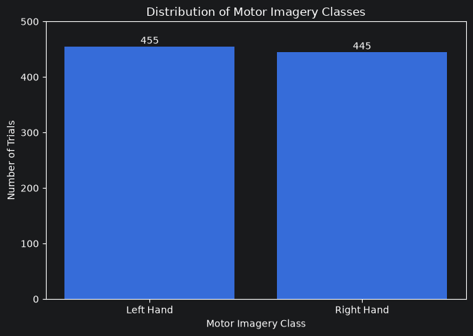
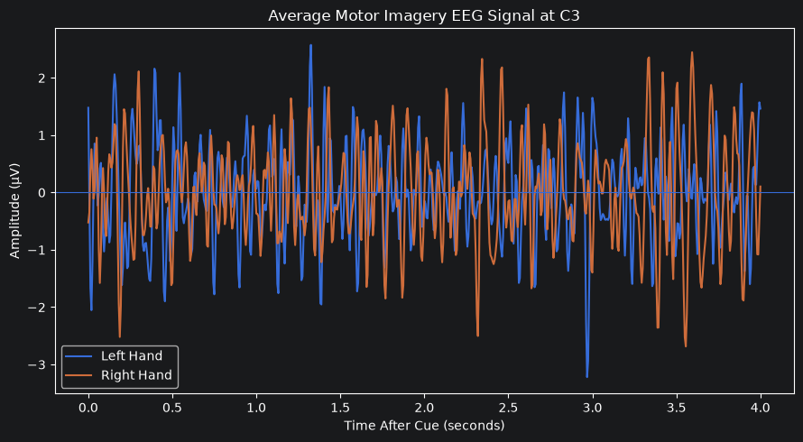
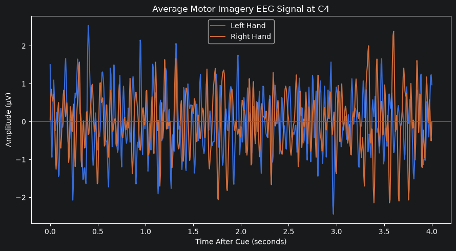
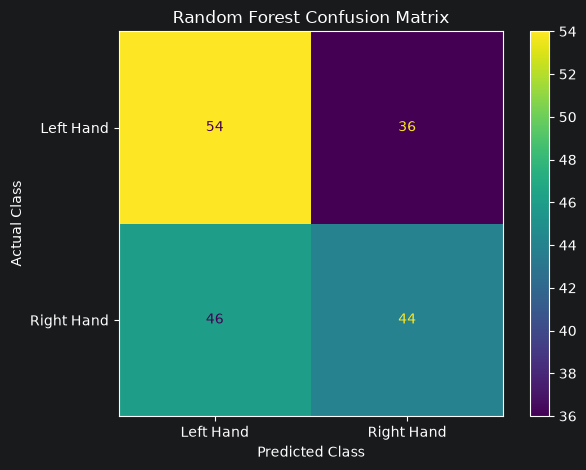
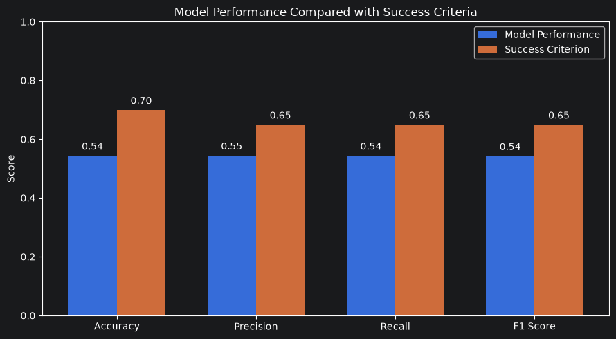

# EEG Motor Imagery Classification

## Project Overview

This project uses machine learning to classify **left-hand and right-hand motor imagery from EEG signals** from the PhysioNet EEG Motor Movement/Imagery Dataset.

EEG signals are band-pass filtered from 8–30 Hz and divided into 0–4 second motor-imagery epochs. **Common Spatial Pattern (CSP)** extracts six spatial features, and a **Random Forest classifier** predicts left-hand or right-hand imagery. Training and testing are separated by participant so the held-out evaluation measures performance on unseen subjects.

## Research Question

**Can a supervised machine learning model distinguish between left-hand and right-hand motor imagery using EEG signal data?**

## Technologies Used

- Python
- Jupyter Notebook
- MNE-Python
- NumPy
- pandas
- scikit-learn
- Matplotlib
- Random Forest
- Common Spatial Pattern (CSP)

## Dataset

The analysis uses the **PhysioNet EEG Motor Movement/Imagery Dataset**. The final project uses motor-imagery runs 4, 8, and 12 from subjects 1–20.

- 20 subjects used in the final analysis
- 64 EEG channels
- 900 usable motor-imagery trials
- 450 left-hand trials
- 450 right-hand trials

## Analysis Process

1. Load motor-imagery EEG recordings from PhysioNet.
2. Filter EEG signals from 8–30 Hz.
3. Create 0–4 second epochs for left-hand and right-hand imagery cues.
4. Split training and test data by participant.
5. Fit CSP on training subjects and extract six features.
6. Train a 200-tree Random Forest classifier with balanced class weights.
7. Evaluate on held-out subjects and with five-fold subject-level cross-validation.

## Results

| Metric | Result |
|---|---:|
| Held-out Accuracy | **54.44%** |
| Macro Precision | **54.50%** |
| Macro Recall | **54.44%** |
| Macro F1 | **54.30%** |
| 5-Fold CV Mean Accuracy | **53.22%** |
| 5-Fold CV Standard Deviation | **3.05%** |

The held-out model performed only slightly above the 50% chance baseline and did not meet the predefined 70% accuracy target. Subject-level cross-validation produced similar results, with fold accuracy ranging from 48.33% to 57.78%.

The result is useful because it shows that this CSP + Random Forest configuration did not generalize well to previously unseen participants. It does not show that EEG motor imagery cannot be classified using other preprocessing methods, features, models, or evaluation designs.

## Visualizations

### Class Distribution



### Average EEG Signal at C3



### Average EEG Signal at C4



### Confusion Matrix



### Model Performance



## Project Structure

```text
eeg-motor-imagery-classification/
├── README.md
├── notebooks/
│   └── eeg_motor_imagery_capstone.ipynb
├── src/
│   ├── __init__.py
│   ├── preprocessing.py
│   ├── feature_extraction.py
│   └── modeling.py
├── images/
│   ├── class_distribution.png
│   ├── eeg_signal_c3.png
│   ├── eeg_signal_c4.png
│   ├── confusion_matrix.png
│   └── model_performance.png
├── requirements.txt
└── .gitignore
```

## Data Source

Schalk, G. (2009). *EEG Motor Movement/Imagery Dataset (Version 1.0.0).* PhysioNet. DOI: `10.13026/C28G6P`
