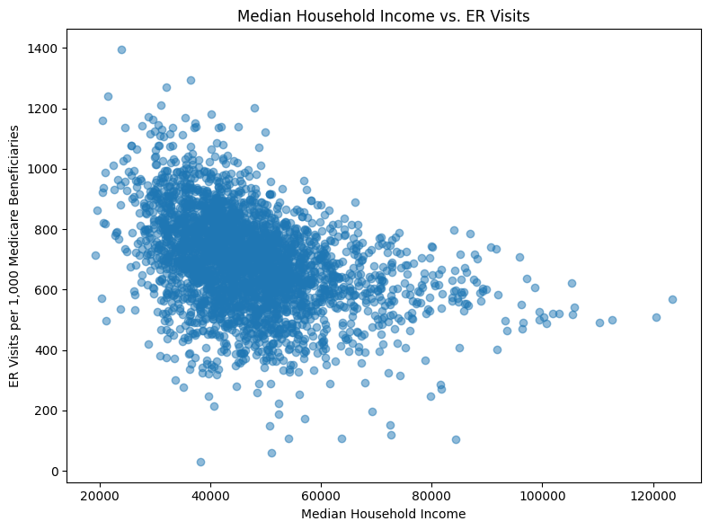
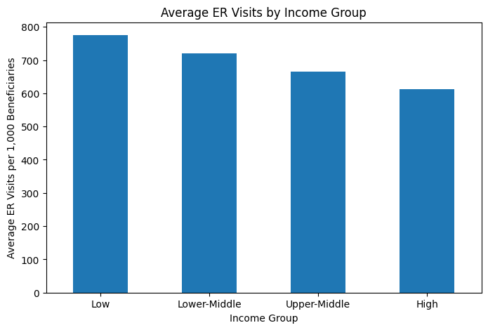

# Healthcare Data Wrangling & Analytics

## Project Overview

This project combines county-level Medicare utilization data with U.S. Census demographic data to examine the relationship between local economic conditions and emergency room use.

CMS Medicare Geographic Variation data are combined with county-level American Community Survey data from the U.S. Census Bureau. The project covers data gathering, quality assessment, cleaning, transformation, merging, analysis, and visualization.

## Research Question

**Is there a relationship between median household income and emergency room visits per 1,000 Medicare beneficiaries at the county level in the United States?**

## Technologies Used

- Python
- Jupyter Notebook
- pandas
- requests
- Matplotlib
- U.S. Census Bureau API
- CSV data
- Data cleaning and merging

## Data Sources

### CMS Medicare Geographic Variation Data

The CMS dataset supplies county-level Medicare utilization measures used in the analysis.

Selected fields include:

- `BENE_GEO_CD` — county FIPS code
- `BENES_TOTAL_CNT` — total Medicare beneficiaries
- `ER_VISITS_PER_1000_BENES` — emergency room visits per 1,000 beneficiaries

### U.S. Census Bureau American Community Survey

County-level demographic data were gathered through the American Community Survey 5-Year API.

Selected fields include:

- `Population`
- `Median_Income`
- `People_In_Poverty`
- State and county FIPS components

## Data Wrangling

The notebook identifies and addresses several data-quality and structural issues.

### Missing CMS Values

Rows missing county FIPS codes, beneficiary counts, or emergency room utilization values are removed before analysis.

### Census Data Types

Population, median household income, and poverty values are converted from object fields to numeric values.

### County FIPS Codes

Separate Census state and county codes are combined into a five-digit county identifier so the Census records can be matched with CMS records.

### Dataset Reduction and Merge

Only fields needed for the analysis are retained. CMS and Census records are then merged at the county level.

## Analysis

Two visualizations are used to examine the relationship between income and emergency room utilization.

### Median Household Income and ER Visits



The notebook finds that counties with lower median household incomes generally tend to have higher emergency room visit rates, with substantial variation among counties.

### ER Visits by Income Group



Counties are also compared across income groups. The notebook finds that counties in the lowest income group have higher average emergency room visit rates than counties in the highest income group.

## Project Structure

```text
healthcare-data-wrangling-analytics/
│
├── README.md
│
├── notebooks/
│   └── healthcare_data_wrangling.ipynb
│
├── src/
│   ├── __init__.py
│   ├── data_quality.py
│   └── analysis.py
│
├── images/
│   ├── income_vs_er_visits.png
│   └── er_visits_by_income_group.png
│
├── data/
│   ├── census_raw.csv
│   ├── cms_census_cleaned.csv
│   └── cleaned_merged_dataset.csv
│
├── docs/
│   ├── 2014-2024 Original Medicare Geographic Variation Data Dictionary.pdf
│   └── Original Medicare Geographic Variation Public Use File Methods Paper.pdf
│
├── requirements.txt
└── .gitignore
```

## Skills Demonstrated

- Data gathering from multiple sources
- REST API requests
- Healthcare data analysis
- Data-quality assessment
- Missing-value handling
- Data-type conversion
- FIPS-code construction
- Dataset merging
- Data cleaning
- Exploratory analysis
- Data visualization
- Jupyter Notebook development

## Running the Project

Install the required packages:

```bash
pip install -r requirements.txt
```

Open the notebook:

```bash
jupyter notebook notebooks/healthcare_data_wrangling.ipynb
```

The repository includes the cleaned and merged datasets used for the portfolio version of the project.
