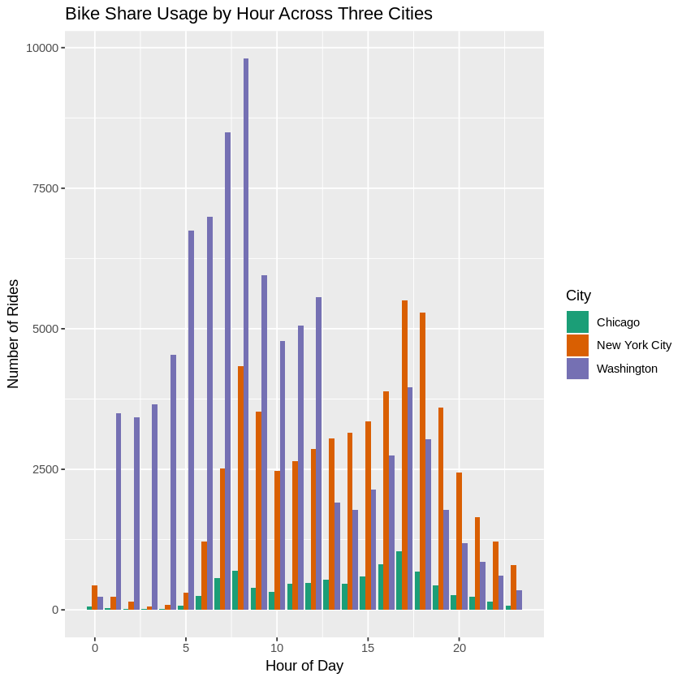
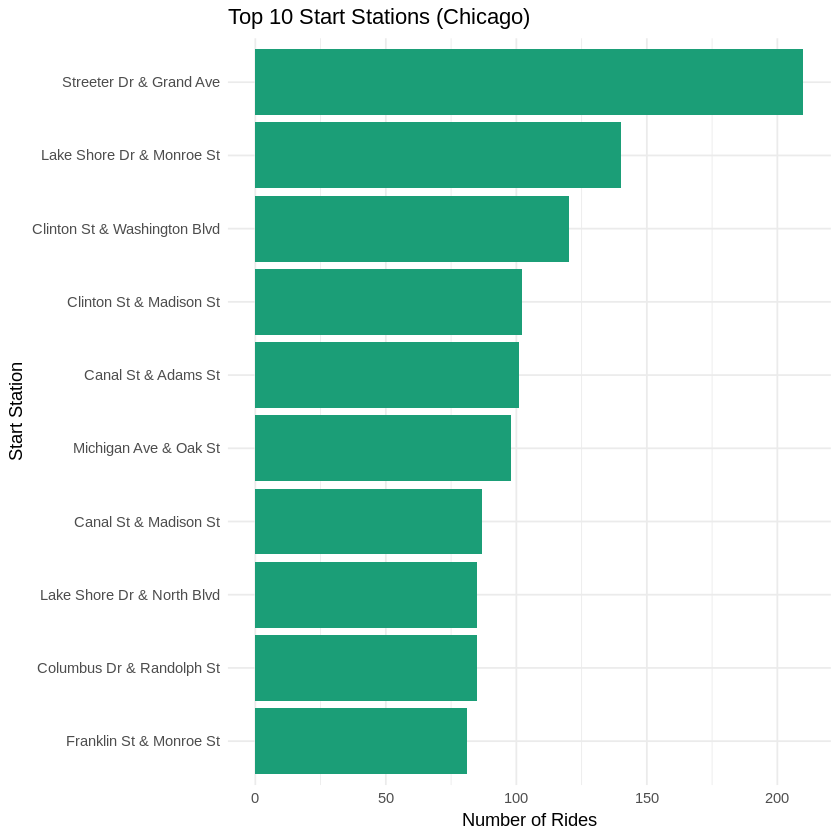
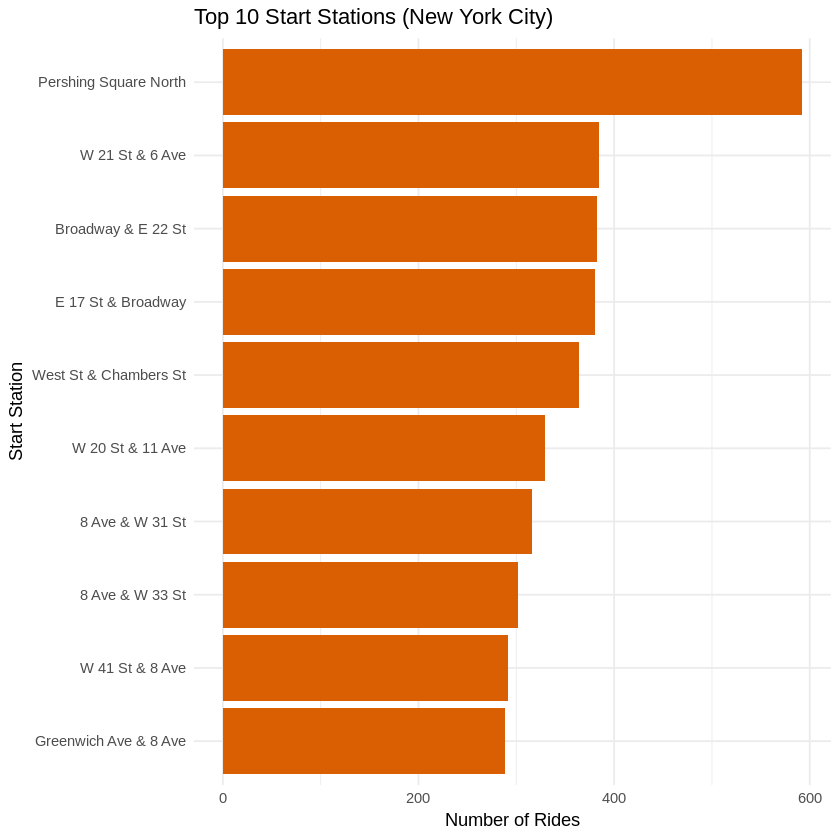
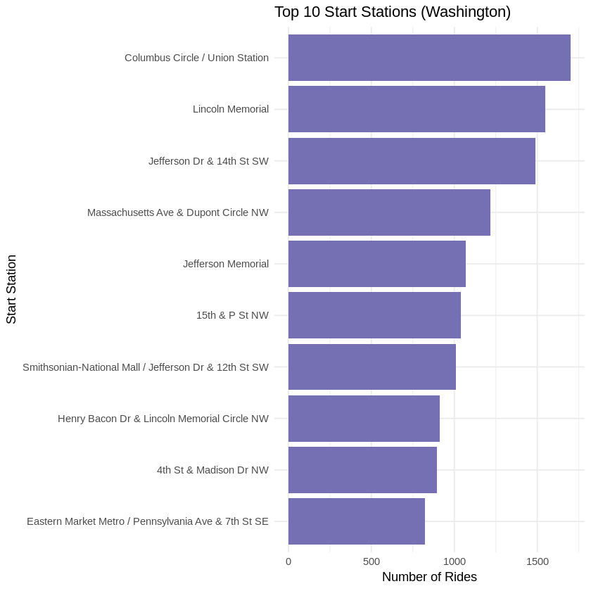
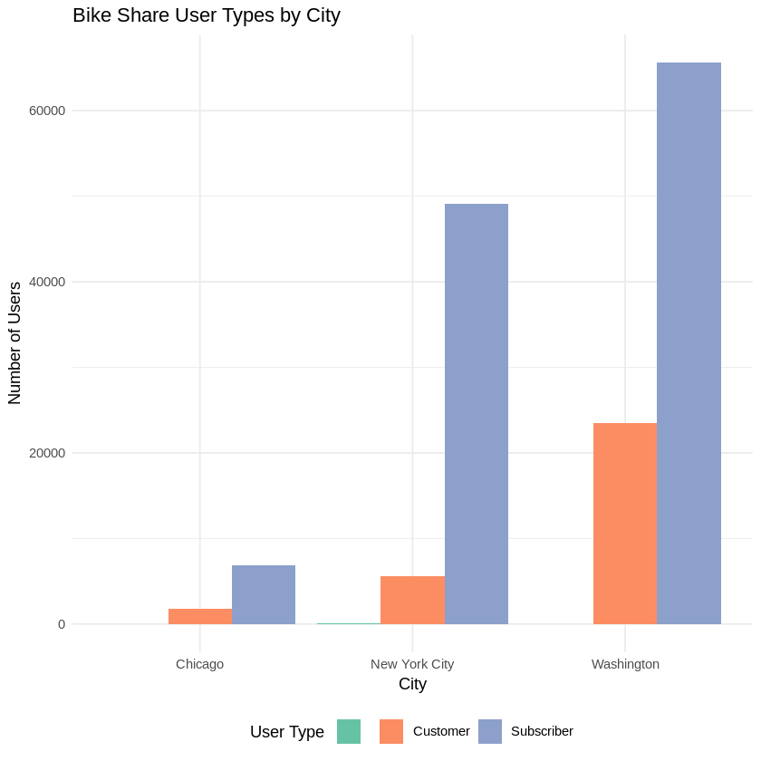

# Bike Share Analysis in R

## Project Overview

This project analyzes bike-share usage in **Chicago, New York City, and Washington, D.C.** using R.

The analysis asks three questions about the supplied bike-share records:

1. When are bike-share systems used most frequently across the three cities?
2. Which start stations are used most frequently?
3. How do user types compare across the cities?

The project imports the three city datasets, prepares time-based variables, calculates usage counts, and visualizes differences with `ggplot2`.

## Technologies Used

- R
- ggplot2
- Data cleaning
- Aggregation
- Date and time processing
- Exploratory data analysis
- Data visualization

## Analysis

### Bike-Share Usage by Time

`Start.Time` is converted to a date-time value and used to derive:

- Month
- Day of week
- Hour of day
- City

The analysis then calculates the busiest month, day, and hour for each city.



### Popular Start Stations

The project counts trips by start station and identifies the ten most frequently used start stations in each city.







### User Types

The project compares bike-share user categories across the three cities and visualizes their distribution.



## Recovered Source Code

The original archive contained a rendered HTML notebook saved under an `.ipynb` filename rather than a standard Jupyter notebook file.

The rendered notebook contains the completed R code and outputs. That code has been recovered into:

```text
src/bike_share_analysis.R
```

The original rendered analysis is preserved unchanged in:

```text
docs/Explore_bikeshare_data.html
```

This keeps the original work available while providing an editable R source file for the portfolio repository.

## Project Structure

```text
bike-share-analysis-r/
│
├── README.md
├── src/
│   └── bike_share_analysis.R
├── images/
│   ├── bike_share_usage_by_hour.png
│   ├── top_start_stations_chicago.png
│   ├── top_start_stations_new_york_city.png
│   ├── top_start_stations_washington.png
│   └── user_type_distribution.png
├── data/
│   └── README.md
├── docs/
│   └── Explore_bikeshare_data.html
├── requirements.txt
└── .gitignore
```

## Data

The analysis references three source files:

```text
chicago.csv
new_york_city.csv
washington.csv
```

Those CSV files were not included in the archived project, so they are not redistributed here.

## Skills Demonstrated

- R programming
- Data import
- Data preparation
- Date-time feature creation
- Data aggregation
- Exploratory data analysis
- Cross-city comparison
- `ggplot2` visualization
- Reusable R functions
