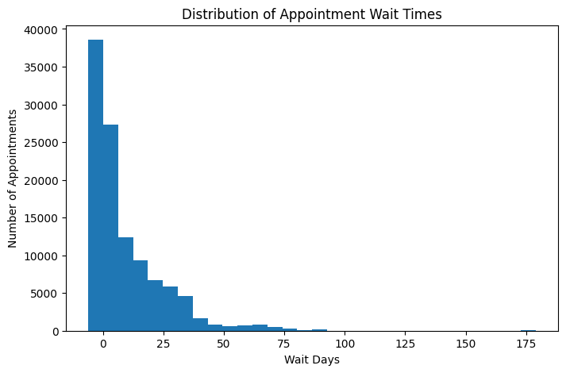
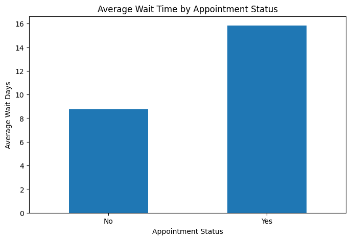
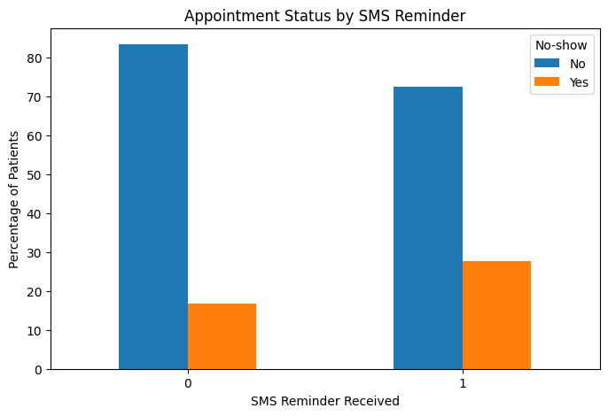
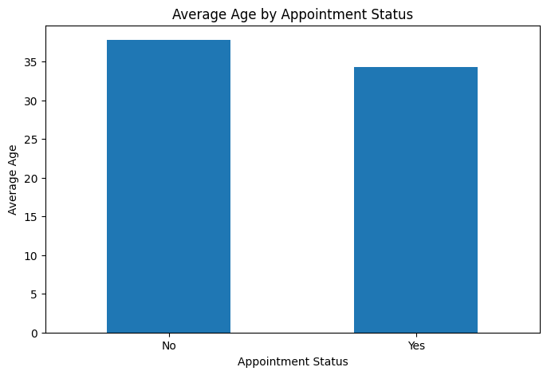

# Medical Appointment No-Show Analysis

## Project Overview

This project analyzes more than **100,000 medical appointments in Brazil** to identify factors associated with whether a patient attends or misses a scheduled appointment.

The analysis examines appointment wait time, SMS reminders, and patient age using Python, pandas, NumPy, and Matplotlib.

## Research Questions

1. Does the number of days between scheduling and the appointment relate to whether patients attend?
2. Does receiving an SMS reminder appear to be associated with appointment attendance?
3. Does patient age appear to be associated with appointment attendance?

## Technologies Used

- Python
- Jupyter Notebook
- pandas
- NumPy
- Matplotlib
- Exploratory Data Analysis
- Data Cleaning
- Data Visualization

## Dataset

The source dataset contains **110,527 appointment records**.

Fields used in the analysis include:

- `ScheduledDay`
- `AppointmentDay`
- `Age`
- `SMS_received`
- `No-show`

A `WaitDays` variable is calculated from the difference between the appointment date and scheduling date.

## Data Preparation

The project converts scheduling and appointment fields to datetime values and calculates the number of days between scheduling and the scheduled appointment.

### Appointment Wait-Time Distribution



Most appointments have relatively short wait times, with fewer appointments having much longer waits.

## Wait Time and Attendance

Patients who missed their appointments had a longer average wait time than patients who attended.



The analysis identifies an association between longer wait times and missed appointments. The dataset is observational, so the result does not establish that longer waits caused patients to miss appointments.

## SMS Reminders and Attendance

The notebook compares appointment outcomes for patients who received an SMS reminder and patients who did not.

The underlying counts reported in the analysis were:

| SMS Reminder | Attended | Missed |
|---|---:|---:|
| Not received | 62,510 | 12,530 |
| Received | 25,698 | 9,784 |



The groups have different attendance rates, indicating an association between SMS reminder status and attendance. Other factors may contribute to the difference.

## Age and Attendance

Patients who attended appointments were older on average than patients who missed them.

- **Attended:** approximately 38 years old
- **Missed:** approximately 34 years old



The difference suggests that age may be associated with appointment attendance in this dataset.

## Project Structure

```text
medical-appointment-no-show-analysis/
│
├── README.md
│
├── notebooks/
│   └── medical_appointment_no_show_analysis.ipynb
│
├── src/
│   ├── __init__.py
│   ├── cleaning.py
│   ├── analysis.py
│   └── visualization.py
│
├── images/
│   ├── wait_time_distribution.png
│   ├── average_wait_time_by_status.png
│   ├── attendance_by_sms_reminder.png
│   └── average_age_by_status.png
│
├── data/
│   └── README.md
│
├── docs/
│   └── Investigate_a_Dataset.html
│
├── requirements.txt
└── .gitignore
```

## Skills Demonstrated

- Data cleaning
- Datetime conversion
- Feature creation
- Exploratory data analysis
- Grouped analysis with pandas
- Cross-tabulation
- Percentage calculations
- Healthcare data analysis
- Data visualization
- Interpretation of observational data

## Running the Project

Install the required packages:

```bash
pip install -r requirements.txt
```

The notebook expects the original `noshowappointments-kagglev2-may-2016.csv` file. Add the dataset to your local working directory or update the CSV path before rerunning the notebook.
